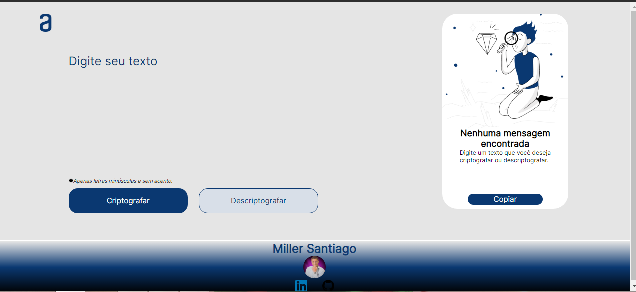

# Decodificador de Texto
 A plataforma Alura propôs um challenge, no qual deveríamos  criar um decodificador de texto. Nesse decodificador eu teria que fazer com que as vogais(a,e,i,o,u) fossem convertidas para palavras "chaves".
Onde a letra "e" seria convertida para "enter".
A letra "i" seria convertida para "imes". 
A letra "a" seria convertida para "ai". 
A letra "o" seria
convertida para "ober". E a letra "u" seria convertida para "ufat". 
Os requisitos pra o funcionamento do programa foram:

1-O programa deve funcionar apenas com letras minúsculas.

2-Não devem ser utilizados letras com acentos nem caracteres especiais.

3-Deve ser possível converter uma palavra para a versão criptografada e também retornar uma palavra criptografada para a versão original.

4-A página deve ter campos para inserção do texto a ser criptografado ou descriptografado, e a pessoa usuária deve poder escolher entre as duas opções.

5-O resultado deve ser exibido na tela.

Existiam mais alguns requisitos, como a criação de um botão que copiasse o texto digitado e a criação de um rodapé. Porém, não eram obrigatórios. 
Requisitos obrigatórios foram apenas os cinco citados acima.

## Imagem do programa:

## Meu nome criptografado:

### Linkedin: https://www.linkedin.com/in/miller-santiago-799bb3150/
###  Site:https://miller110.github.io/Decodificador-de-Texto/
